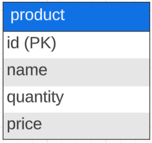
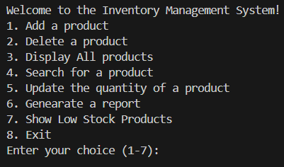
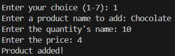
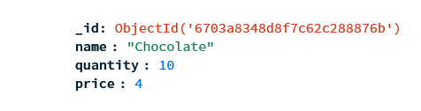
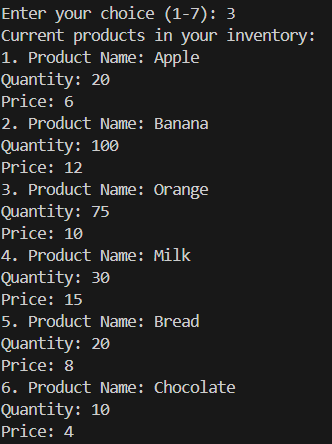
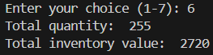

# Inventory Management System
The Inventory Management System is a Python-based application that allows you to manage your product inventory. It connects to a MongoDB database (specifically, MongoDB Cloud or MongogDB Atlas) and provides functionalities such as adding products, deleting products, displaying the inventory, searching for products, updating quantities, generating reports, and identifying low-stock products.

# Database Schema


# Features
1. Add a Product:
   * Add a new product to the inventory by providing its name, quantity, and price.
2. Delete a Product:
   * Remove a product from the inventory using its name.
3. Display All Products:
   * View a list of all products currently in the inventory.
4. Search for a Product:
   * Search for a product by name (case-insensitive).
5. Update Product Quantity:
   * Modify the quantity of an existing product.
6. Generate Reports:
   * Calculate the total quantity of all products.
   * Compute the total inventory value (quantity × price).
7. Show Low Stock Products:
   * Identify products with quantities below a specified threshold.

# Prerequisites
Before running the application, make sure you have the following:
   * Python 3.x installed
   * MongoDB Cloud account (with a connection string)
     * https://www.mongodb.com/products/platform/cloud
   * Environment variables set for your MongoDB connection string (e.g., mongodb_key)

# Installation
1. Clone this repository to your local machine:
```
git clone https://github.com/your-username/inventory-management-system.git
```

2. Install the required Python packages:
```
pip install pymongo dotenv
```

3. Create a `.env` file in the project directory and add your MongoDB connection string:

```
mongodb_key="your_connection_string_here"
```

# Usage
1. Run the program:

```
python main.py
```

2. Follow the menu prompts to interact with the inventory system.



# Example outputs
1.  Add a product



Meawhile, new product Chocolate is added in MongoDB cloud:



3. Display all products



6. Generate report



# Others
`example_invenotry.mongodb` file contains commands written by mongoDB syntax. There is no need to modify anything. After connection to MongoDB cloud and clicking the run button, it will create the example products in the MongoDB cloud for you to familiarize youself with the system.
